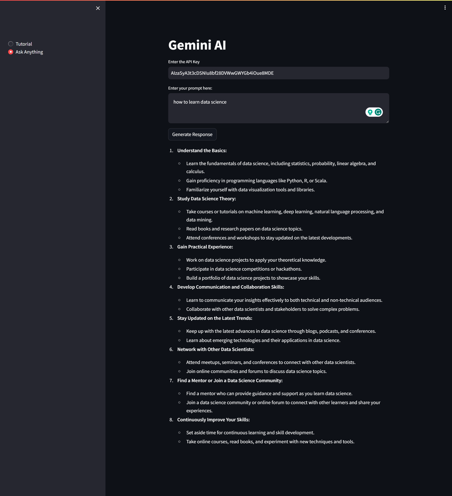

### `Gemini`-using-streamlit

**[Google Colab Demo](https://colab.research.google.com/drive/13Sg05ikAzSyrd3DXcOJXsSSFzk3kpHc8?usp=sharing)**

#### Usage


#### Local Installation

```
git clone https://github.com/datasciritwik/gemini-using-streamlit.git
cd gemini-using-streamlit
```
```
pip install requirements.txt
```
```
streamlit run app.py
```

